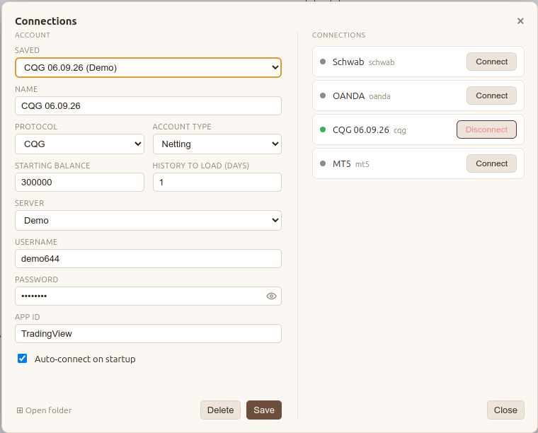

# CQG Adapter

The CQG adapter is an integration with the official [CQG WebSocket API](https://partners.cqg.com/api-resources/web-api/documentation).

It is a cloud broker: the app connects over the internet to CQG's gateway for real-time quotes, historical bars, and order routing on futures markets.

## Connecting

1. In the **Saved** dropdown, click **New Account**.
2. Select **CQG** as the protocol.
3. Select the **Server** type (Demo or Live).
4. Enter your **App ID** — the identifier your CQG connection was set up for.
5. Fill out the remaining fields (username, password, and account details).
6. Click **Connect**.

