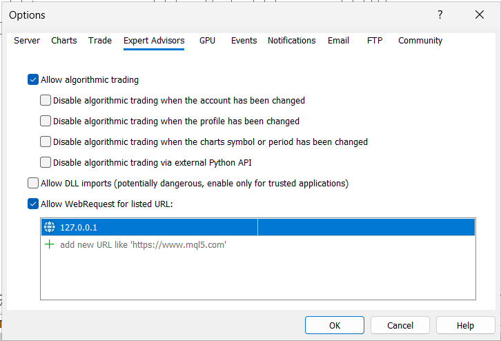
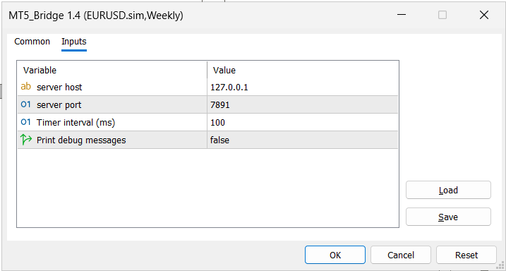
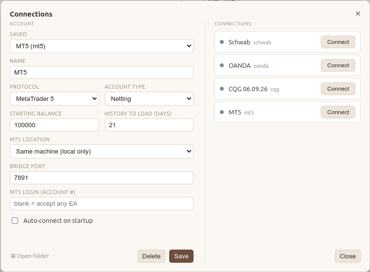
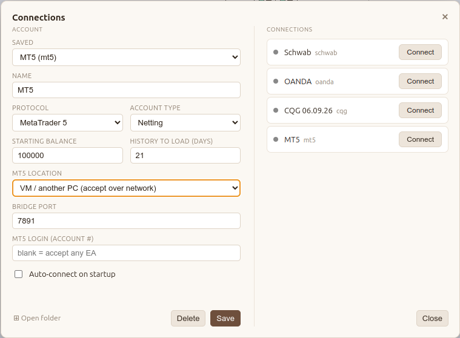

# MetaTrader 5 Adapter

The MetaTrader 5 adapter connects the app to a running MT5 terminal using a small bridge Expert Advisor (EA).

Unlike cloud brokers, which connect over the internet, the MT5 adapter communicates directly with a locally running MT5 terminal. The app listens for a connection via a local TCP socket, and the bridge EA connects to it.

Once connected, the EA streams market data, account information, and trade updates to the app. When you place an order, the app sends it back through the EA to the MT5 terminal.

```
                    Local Computer

+-------------------+       Local TCP        +------------------------+
|      Your App     | <------------------->  |   MT5 Terminal         |
|  (listens/accepts)|    EA dials in         |  (logged in to broker) |
+-------------------+                        |   +----------------+   |
                                             |   |  Bridge EA     |   |
                                             |   +----------------+   |
                                             +------------------------+
```

## Why no Python bridge

A common way to reach MT5 is the official `MetaTrader5` Python package. Native EA over TCP is used instead, for three reasons:

1. **No extra runtime.** Pure Node socket on one end, native MQL5 EA on the other — no Python interpreter, no `MetaTrader5` package, nothing to install or version between them.

2. **Portable by design.** The Python bridge is Windows-only and pins the terminal to the same host; the EA-over-TCP runs identically on native Windows, under Wine on Linux, or across a VM — one code path.

3. **Direct and fewer parts.** The EA speaks to MT5 through the terminal's own functions and dials the app straight over TCP — no intermediary process, one serialization hop instead of two.

## MT5 on Windows

**In MT5:**

1. **Tools -> Options -> Experts**
   - Check **Allow algorithmic trading**
   - Check **Allow WebRequest for listed URL**, add `127.0.0.1`

   
2. Attach the **MT5_Bridge** EA to any chart. Inputs:
   - Host `127.0.0.1`
   - Port `7891`

   
3. Toolbar -> click **Algo Trading** so it is green.

**In the app:**

4. Add an MT5 account -> **MT5 location: Same machine**, Port `7891`

   
5. Connect.


### MT5 on VM (Windows)

1. MT5 -> **Tools -> Options -> Expert Advisors**
   - Check **Allow algorithmic trading**
   - Check **Allow WebRequest for listed URL**, add `192.168.122.1`
2. Attach the **MT5_Bridge** EA to any chart. Inputs:
   - Host `192.168.122.1`
   - Port `7891`
3. Toolbar -> click **Algo Trading** so it is green (enabled).
   The chart's top-right corner then shows the EA name with a blue dot.

### In the app

4. Add an MT5 account:
   - **MT5 location:** VM / another PC
   - **Port:** `7891`

   
5. Connect. Data flows.

### If it does not connect

- In the VM, run in PowerShell: `Test-NetConnection 192.168.122.1 -Port 7891`
  - `True` -> the EA setting is the problem: recheck step 1 (the allowlist) and step 3 (Algo Trading green).
  - `False` -> the app is not listening or the VM cannot reach it: make sure the app is connecting, then retry.
- `192.168.122.1` is the host address for a libvirt/QEMU VM. On the host, confirm it with `ip addr show virbr0`
  (use the IP on the `inet` line).