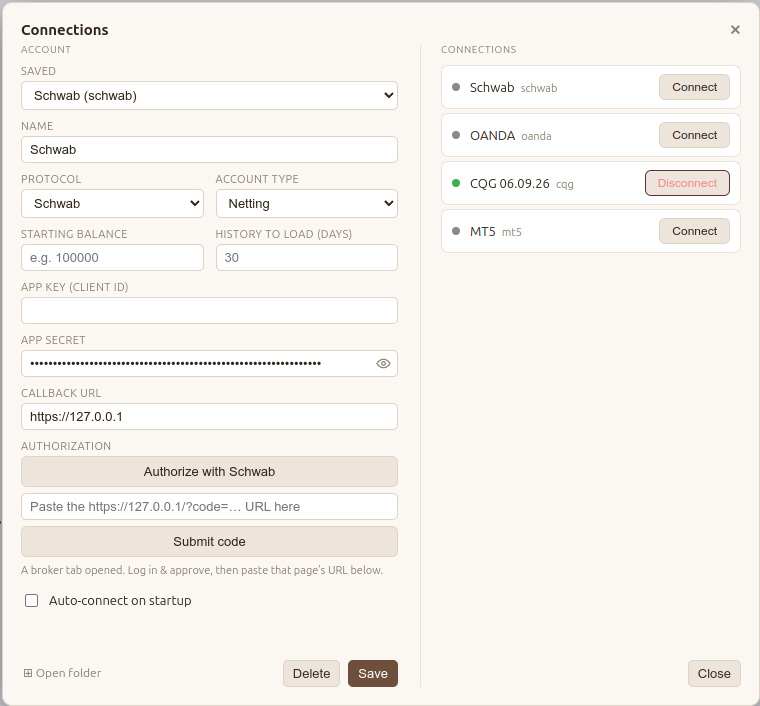

# Schwab Adapter

The Schwab adapter integrates with the official [Schwab Trader API](https://developer.schwab.com/) for stocks and options market data and trading.

It is a cloud broker, but unlike the others it needs a one-time setup: you register your own developer app with Schwab, wait for approval, then authorize the app through Schwab's OAuth flow. Plan for it to take about a day.

## Work in Progress

The **market data** layer is fully implemented. The **account and trading** layer is not yet fully integrated — Schwab has no demo/paper tier, so the write path can't be exercised without a funded, live account.

- **Proven** — market data (quotes, bars, history, market-hours, symbol search), `resolveSymbol` tick sizing, and account reads (`getAccount` plus the account leg of the trade stream).
- **Mapped but unverified** — `getPositions`, `getOrders`, and `getHistory`, plus the position/order legs of the trade stream. These follow Schwab's documented shapes but have never been observed against a real position or order.
- **Not implemented** — order execution (`placeOrder`, `cancelOrder`, `modifyOrder`, `closePosition`). Deferred behind a safe test path until a funded account is available.

## 1. Create a Schwab developer app

This is separate from your actual brokerage account.

1. Open a developer account at [developer.schwab.com](https://developer.schwab.com/).
2. Once logged in, go to **API Products** and pick **Trader API - Individual**.
3. Click **View Apps**, then **Create App**.
4. Select an **API Product** — **Market Data Production** and/or **Accounts and Trading Production**. You can add both to the same app.
5. Enter the **Callback URL**: `https://127.0.0.1`
6. Fill out the rest of the requested information and hit **Create**.
7. Wait about a day for approval. When it is ready, its **Status** shows **Ready For Use**.
8. Open **View Details** for the app and copy its **Client ID** and **Client Secret** — you need them to connect.

## 2. Connect in the app

1. Click **Connect** in the upper-right corner to open the **Connections** dialog.
2. In the **Saved** dropdown, press **New Account**.
3. Pick **Schwab** as the protocol and account type.
4. Enter your **App Key (Client ID)**, **App Secret**, and **Callback URL**.
5. Click **Authorize with Schwab**.
6. A browser window opens and guides you through Schwab's authorization steps.
7. At the end you land on a page that fails to open at `https://127.0.0.1/...`. That is expected — copy the **full address**. It carries your authorization code, which is time-limited, so do not wait too long.
8. Back in the app, paste that address into the field under the **Authorize with Schwab** button and press **Submit code**.
9. Press **Save** to save the account.
10. On the right, an entry with a **Connect** button appears for Schwab. Click **Connect** — you are done.

