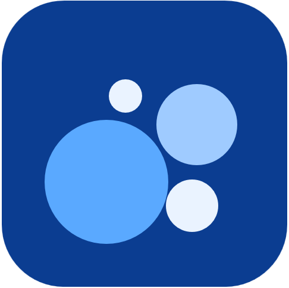

<!-- logo -->
<p align="center">
    <a href="https://plaincharts.github.io/kapelka/" alt="kapelka logo">
    </a>
</p>

<h1 align="center">kapelka</h1>

<h4 align="center">
    An open source declarative, reactive charting library in JavaScript.
</h4>

<div align="center">
    <a href="#concept">Concept</a> |
    <a href="#features">Features</a> |
    <a href="#install">Install</a> |
    <a href="#quick-start">Quick start</a> |
    <a href="#attributions">Attributions</a> |
    <a href="#license">License</a>
</div>

<div align="center">
    <a href="https://plaincharts.github.io/kapelka/" target="_blank" rel="noopener">Website</a> |
    <a href="https://plaincharts.github.io/kapelka/docs/getting-started/" target="_blank" rel="noopener">Getting Started</a> |
    <a href="https://plaincharts.github.io/kapelka/docs/overview/" target="_blank" rel="noopener">Docs</a> |
    <a href="https://plaincharts.github.io/kapelka/docs/api/" target="_blank" rel="noopener">API References</a>
</div>

<br></br>

## Concept

kapelka is a zero-dependency, framework-free charting engine in plain JavaScript. It began as a de-framework port of [trading-vue-js](https://github.com/tvjs/trading-vue-js) by C451. The plain-JavaScript rendering core was lifted out intact, the Vue shells were replaced by a single engine, and a clean chart API was exposed on top. Studies, drawing tools, and the skin all sit on that API.

There is no build step. You mount a chart, add a series, and feed it data.

## Features

### Rendering
- Reactive, declarative rendering with its own coordinate system, panes, and crosshair.
- Series types: candles, line, area, baseline, columns, segments, and horizontal bars, plus your own custom render primitive.
- Axis modes: linear, log, percent, and indexed-to-100, with overlay price scales that auto-fit their own region.
- Touch support: one-finger pan, pinch zoom, long-press tracking cursor, and kinetic pan.
- Index-based mode collapses session and weekend gaps instead of leaving whitespace.

### Studies
- Studies compute off the render thread in a Web Worker.
- The worker owns the bars resident, reads one shared window, and streams only the last point on a live tick.
- Two forms coexist: series studies stream per bar through `step`, geometry studies recompute whole-array shapes through `calc`.

### Drawing
- The ether is a declarative drawing substance where shapes are data, resolved by one stateless renderer every frame.
- A shape library of reusable recipes, plus cross-pane shapes so a sub-pane study can draw on the price pane.

### Skin
- An optional, framework-free chrome layer with a legend, controls, and a config window. The CSS is brand-agnostic, so you can theme it.

## Install

kapelka is a single ES module with zero dependencies and no build step. Served over any static file server, it needs no bundler. Add it to your project and import from its entry:

```js
import { mountChart, Candles } from 'kapelka';
```

## Quick start

```js
import { mountChart, Candles } from 'kapelka';

// Mount a chart into a container element.
const chart = mountChart(document.getElementById('chart'), {
  layout: { background: { color: '#d1d4dc' }, textColor: '#50535e' },
  timeAxis: { timeVisible: true },
});

// Add a candle series and feed it bars. time is UNIX seconds.
const candles = chart.addPlot(Candles, {});
candles.feed([
  { time: 1719412800, open: 5500, high: 5510, low: 5495, close: 5505, volume: 1200 },
  // ...more bars
]);
```

Push a live update with `candles.feedBar(bar)`. See the [API reference](https://plaincharts.github.io/kapelka/docs/api/) for the full surface.

## Attributions

People and open source projects that made it possible.

- Chart engine (kapelka) ports [trading-vue-js](https://github.com/tvjs/trading-vue-js) by C451 — MIT License
- Additional optimization and drawing logic was inspired by [night-vision](https://github.com/project-nv/night-vision) by C451.

Full license texts: see `licenses/`

## License

[](LICENSE)  

Licensed under the [MIT License](LICENSE). Use it freely, including in closed-source and commercial projects. kapelka incorporates trading-vue-js and night-vision (both MIT by C451), and their notices are kept in `licenses/`.